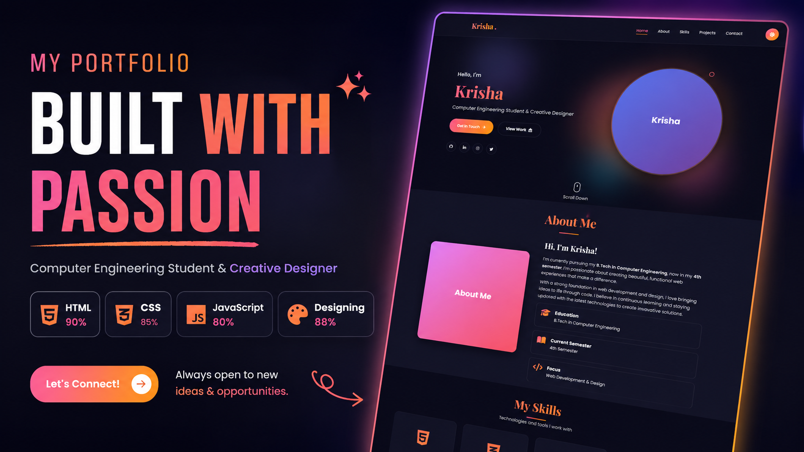

# 🎨 Yashvi's Premium Portfolio Template

<p align="center">
  
</p>

<p align="center">
  <a href="https://Yashvi15607.github.io/Portfolio-Template/"></a>
  
  
</p>

<p align="center">
  A stunning, ultra-modern, and fully responsive <b>Glassmorphism Portfolio Template</b> crafted with passion. Designed using semantic <b>HTML5</b>, custom modern <b>CSS3 (Vanilla)</b>, and lightweight <b>Vanilla JavaScript</b>. No external CSS frameworks are required.
</p>

---

## ⚡ Quick Links
- [Live Preview Link](https://Yashvi15607.github.io/Portfolio-Template/)
- [Key Features](#-key-features)
- [Project Architecture](#%EF%B8%8F-project-architecture)
- [Quick Start](#-quick-start)
- [How to Customize](#%EF%B8%8F-how-to-customize)
- [Color System](#-color-system)

---

## ✨ Key Features

### 🌓 Theme Engine (Dark & Light Mode)
- Seamlessly transition between gorgeous dark and light themes.
- Persistent state saved in **Local Storage** so the browser remembers user preference.
- Smooth rotation and fade transitions on the theme toggle button.

### 🎨 Premium Glassmorphism UI
- Fully styled cards using `backdrop-filter` for an elegant frosted-glass blur.
- Floating animated background spheres that glide smoothly on the screen.
- Glowing border outlines and deep drop-shadow effects (`box-shadow`) to create an authentic sense of depth.

### 🧭 Interactions & Parallax
- **Interactive Cursor:** A custom circular pointer that follows the mouse and scales dynamically when hovering over clickable elements.
- **Auto-Typewriter Effect:** Text in the hero section types itself out dynamically on load.
- **Scroll Animations:** Intersection Observer API triggers smooth fade-in and slide-up animations as components enter the viewport.
- **Parallax Hero Scroll:** The hero banner shifts slightly with scroll depth, creating a premium 3D feeling.

### 📱 Responsive By Design
- Fluid layouts adapting flawlessly across mobile, tablet, and ultra-wide screens.
- Sliding mobile drawer menu triggered by a custom animated hamburger icon.

### 🛡️ Smart Contact Form
- Built-in form validation and prevention of empty submissions.
- Dynamically rendered notification popups with gradient background styles.

---

## 🛠️ Built With

The project uses zero heavy dependencies to keep load times near-instantaneous:

| Component | Technology | Details |
| :--- | :--- | :--- |
| **Core Structure** | HTML5 | Semantic elements, meta tags for SEO Optimization |
| **Styling** | Vanilla CSS3 | Custom Properties (Variables), Flexbox, CSS Grid, Transitions |
| **Interactions** | Vanilla JavaScript | LocalStorage API, IntersectionObserver, Canvas API |
| **Typography** | Google Fonts | *Poppins* (Body) & *Playfair Display* (Headings) |
| **Iconography** | FontAwesome v6.5 | Modern vector icons for social media and indicators |

---

## 📁 Project Architecture

Here is how the project files are organized:

```bash
Yashvi-Portfolio-Template/
│
├── assets/
│   └── portfolio_preview.png     # Banner image for repository overview
│
├── index.html                    # Main HTML document structure & content
├── style.css                     # Complete styles, variables & theme definitions
├── script.js                     # Cursor tracking, scroll spies, and theme toggle code
└── readme.md                     # Documentation file
```

---

## 🚀 Quick Start

To run this project locally, you don't need compilation tools, package managers, or local servers.

1. **Clone the Repository**
   ```bash
   git clone https://github.com/Yashvi15607/Portfolio-Template.git
   ```

2. **Navigate into Directory**
   ```bash
   cd Portfolio-Template
   ```

3. **Launch the site**
   - Double click `index.html` or open it via terminal:
     ```bash
     open index.html
     ```

---

## 🎨 Color System

The site defines standard theme tokens using CSS variables inside [`style.css`](file:///Users/mitulaghara/Desktop/Yashvi/Github%20&%20Linkedin/Yashvi%20Portfolio%20Templete/style.css):

```css
:root {
    --primary-color: #ff6b9d;       /* Soft Neon Pink */
    --secondary-color: #c44569;     /* Deep Crimson Pink */
    --accent-color: #ffa502;        /* Vibrant Amber Orange */
    
    /* Premium Gradients */
    --gradient-primary: linear-gradient(135deg, #ff6b9d 0%, #ffa502 100%);
    --gradient-1: linear-gradient(135deg, #667eea 0%, #764ba2 100%);
    --gradient-2: linear-gradient(135deg, #f093fb 0%, #f5576c 100%);
}
```

---

## 🔧 How to Customize

Follow these simple steps to make this portfolio your own:

### 1. Update Content
Open [`index.html`](file:///Users/mitulaghara/Desktop/Yashvi/Github%20&%20Linkedin/Yashvi%20Portfolio%20Templete/index.html) and search for the placeholders:
* **Hero Text:** Update lines `56-58` with your name and custom tagline.
* **Social Links:** Update `href` attributes in lines `70-82`.
* **About Section:** Change the text under the `About Me` section on lines `114-124`.

### 2. Replace Project Images
By default, the template uses an **HTML Canvas Generator** in JS to generate beautiful colorful placeholders so the site runs perfectly without images. To add your own work:
1. Place your images in a folder (e.g. `assets/`).
2. Update the `` `src` properties in the project cards (`index.html` lines `217`, `234`, `251`).
3. Comment out or delete the placeholder code in [`script.js`](file:///Users/mitulaghara/Desktop/Yashvi/Github%20&%20Linkedin/Yashvi%20Portfolio%20Templete/script.js) (lines `298-305`) so they do not overwrite your custom sources.

---

## 🤝 Connect & Support

Created with passion for **Yashvi** — a Computer Engineering student building gorgeous web experiences.

* 🌟 If you liked this template, give it a star!
* 📧 Got questions? Open an issue or reach out through the contact form.

---

<p align="center">Made with ❤️ and CSS Glassmorphism</p>
